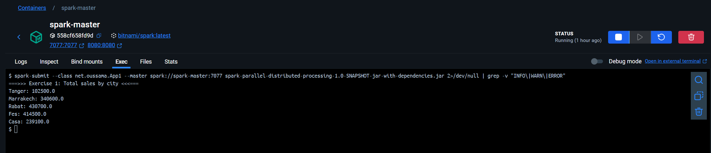
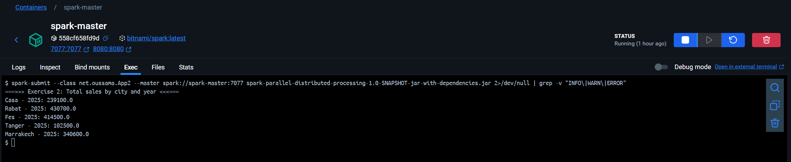
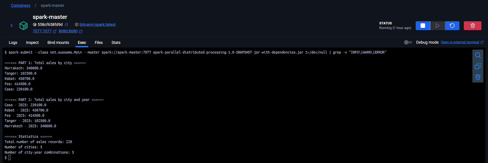

# 🚀 Traitement parallèle et distribué avec Apache Spark

Ce projet démontre le traitement **parallèle** et **distribué** de données de ventes avec **Apache Spark** en utilisant Java. L'application est testée localement puis déployée sur un **cluster Docker**.

---

## 📋 Description du Projet

### **Exercice 1 : Total des ventes par ville**
Développement d'une application Spark qui analyse un fichier `ventes.txt` pour calculer :
- Le **total des ventes par ville**

### **Exercice 2 : Total des ventes par ville et année**
Extension de l'application pour calculer :
- Le **total des ventes par ville et par année**

**Format du fichier d'entrée :**
```
date,ville,produit,prix
2025-01-01,Rabat,Ordinateur,7000.0
2025-01-01,Marrakech,Imprimante,3000.0
2025-01-01,Fes,Ecran,1500.0
```

---

## 📁 Structure du Projet

```
spark-parallel-distributed-processing/
├── src/
│   └── main/
│       └── java/
│           └── net/
│               └── oussama/
│                   ├── App1.java        # Total des ventes par ville
│                   ├── App2.java        # Total des ventes par ville et année
│                   └── Main.java        # Application combinée
├── ventes.txt                          # Données de ventes
├── pom.xml                             # Configuration Maven
└── target/
    └── spark-parallel-distributed-processing-1.0-SNAPSHOT-jar-with-dependencies.jar
```

---

## ⚙️ Technologies Utilisées

- **Java 11**
- **Apache Spark 3.5.5**
- **Maven 3.8+**
- **Docker & Docker Compose**
- **Bitnami Spark Docker image**

---

## 🛠️ Configuration et Compilation

### Configuration Maven (pom.xml)
```xml
<properties>
    <maven.compiler.source>11</maven.compiler.source>
    <maven.compiler.target>11</maven.compiler.target>
    <project.build.sourceEncoding>UTF-8</project.build.sourceEncoding>
</properties>
```

### Compilation
```bash
mvn clean package
```

---

## 🚀 Exécution Locale

### Application 1 : Classement des prix total des ventes par ville
```bash
spark-submit --class net.oussama.App1 --master spark://spark-master:7077 spark-parallel-distributed-processing-1.0-SNAPSHOT-jar-with-dependencies.jar
```



### Application 2 : Classement des prix total des ventes par ville et année
```bash
spark-submit --class net.oussama.App2 --master spark://spark-master:7077 spark-parallel-distributed-processing-1.0-SNAPSHOT-jar-with-dependencies.jar
```



---

## Déploiement sur Cluster Spark


### 1. Démarrage du cluster
```bash
docker-compose up -d
```

Interface Web Spark : [http://localhost:8080](http://localhost:8080)

### 3. Copie des fichiers dans le conteneur
```bash
docker cp ./spark-parallel-distributed-processing-1.0-SNAPSHOT-jar-with-dependencies.jar spark-master:/opt/bitnami/spark
docker cp ./spark-parallel-distributed-processing-1.0-SNAPSHOT-jar-with-dependencies.jar spark-worker-1:/opt/bitnami/spark

docker cp ./ventes.txt spark-master:/opt/bitnami/spark
```

### 4. Exécution sur le cluster
```bash
docker exec -it spark-master bash
cd /opt/bitnami/spark

# Exécution de l'application principale
spark-submit --class net.oussama.Main --master spark://spark-master:7077 spark-parallel-distributed-processing-1.0-SNAPSHOT-jar-with-dependencies.jar
```

---

## Résultats dans le Cluster Spark

### Exécution des calculs de ventes par ville et année


---

## 💡 Conclusion

Ce projet démontre la puissance d'Apache Spark pour le traitement parallèle et distribué de données. À travers ces applications, nous avons illustré :

1. **La simplicité de développement** : Spark permet d'implémenter des analyses complexes avec peu de code
2. **La scalabilité** : La même application fonctionne localement et sur un cluster distribué
3. **La flexibilité** : Les transformations RDD permettent diverses analyses sur les mêmes données
